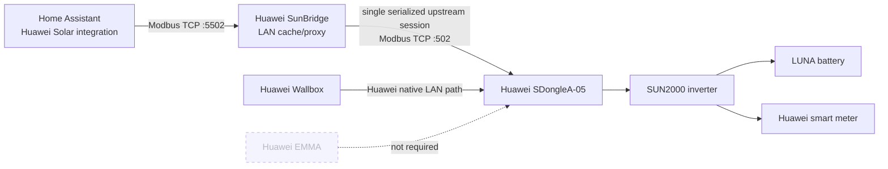
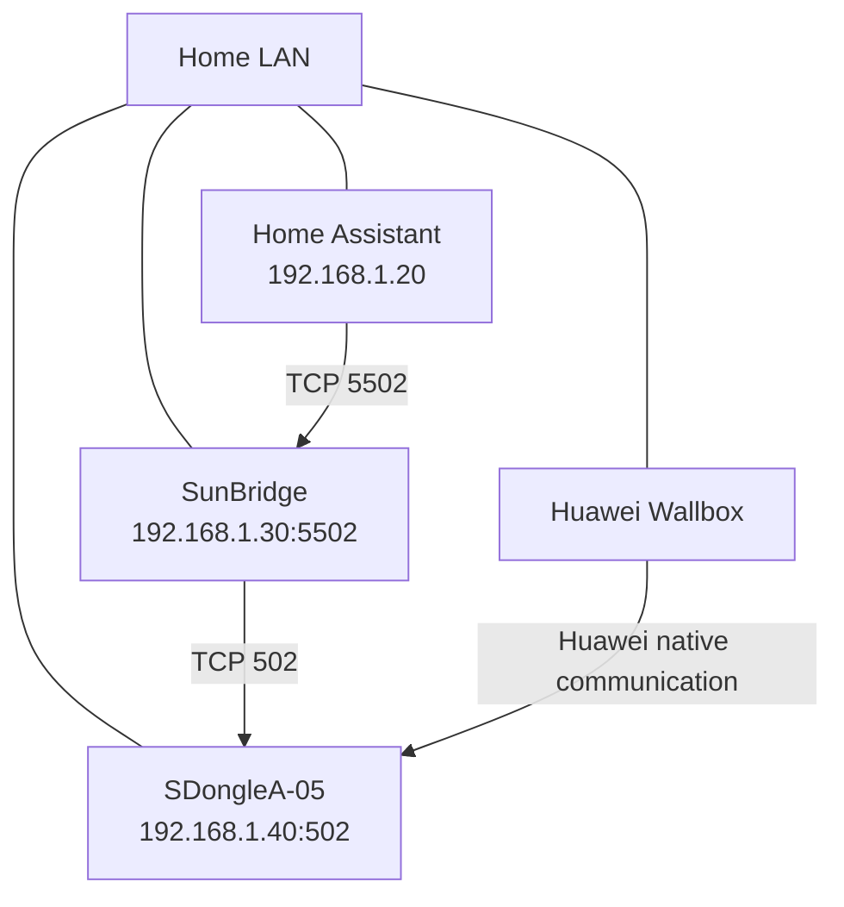

# Huawei SunBridge Modbus

A lightweight LAN-only Modbus TCP cache/proxy for Huawei SUN2000 installations using an SDongle.

> **Goal:** work around the SDongle's very limited Modbus TCP connection capacity without adding Huawei EMMA.
>
> **Everything stays on your LAN.**

## Why this exists

Huawei SDongle installations can become unstable when several devices try to use Modbus TCP at the same time.

A typical example is:

- Huawei Wallbox already communicating through the Huawei installation
- Home Assistant reading the inverter through Modbus TCP
- inverter + smart meter + battery data all needed at the same time

SunBridge lets Home Assistant talk to a local cache/proxy instead of continuously consuming another direct Modbus session on the SDongle.

## Architecture



### In one picture

```text
                     ┌───────────────────────┐
                     │      Home Assistant   │
                     │  Huawei Solar HACS    │
                     └───────────┬───────────┘
                                 │
                         Modbus TCP :5502
                                 │
                     ┌───────────▼───────────┐
                     │   Huawei SunBridge    │
                     │    cache / proxy      │
                     │     LAN only          │
                     └───────────┬───────────┘
                                 │
                  serialized Modbus TCP :502
                                 │
                     ┌───────────▼───────────┐
                     │   Huawei SDongleA-05  │◄──────── Huawei Wallbox
                     └───────────┬───────────┘
                                 │
                     ┌───────────▼───────────┐
                     │   Huawei SUN2000-L1   │
                     ├───────────┬───────────┤
                     │           │           │
                  Battery     Smart meter   PV

                       Huawei EMMA: NOT REQUIRED
```

## What problem it solves

The SDongle exposes Modbus TCP but supports only a very small number of concurrent sessions reliably. In real installations, opening additional connections can lead to timeouts, dropped reads or unstable device discovery.

SunBridge reduces Home Assistant traffic to a controlled, paced upstream polling session and serves cached values locally to clients.

## Important behavior discovered on the tested SDongle

The tested SDongleA-05 was much more reliable with the following timing:

```text
TCP connect
    ↓
wait 2 seconds
    ↓
first Modbus request
    ↓
response
    ↓
wait ~500 ms
    ↓
next batch
    ↓
...
    ↓
close connection
```

The working implementation also reads complete Modbus TCP frames instead of assuming that a single TCP `read()` contains a complete response.

## Tested hardware and firmware

This is the exact configuration used during development and validation.

| Component | Tested model / version |
|---|---|
| Inverter | **Huawei SUN2000-4.6KTL-L1** |
| Inverter firmware | **V200R001C00SPC155** |
| Inverter Modbus Unit ID | **1** |
| SDongle | **Huawei SDongleA-05** |
| SDongle firmware | **V200R025C00SPC130** |
| SDongle protocol | **P1.15-D50.0** |
| SDongle monitoring hardware revision | **B** |
| Huawei Wallbox | **Huawei SCharger 7.4 kW single-phase** |
| Upstream Modbus TCP | **port 502** |
| Home Assistant integration | **Huawei Solar 2.1.5** |
| Optional Wallbox integration | **lbbrhzn/ocpp via local OCPP WebSocket** |
| Downstream SunBridge port | **5502** |
| Host used for testing | **Debian 12 LXC on Proxmox** |

### Confirmed working in this setup

- inverter entities
- grid/power-meter entities
- battery entities
- Huawei Wallbox remaining on the normal Huawei path
- Huawei SCharger connected separately to Home Assistant via local OCPP
- FusionSolar remaining operational
- Home Assistant reading through SunBridge
- no Huawei EMMA required
- LAN-only data path for the proxy

For the tested Huawei SCharger OCPP setup, including the local WebSocket configuration and currently validated entities/status, see [Home Assistant + Huawei Solar](docs/HOME-ASSISTANT.md#optional-huawei-scharger-in-home-assistant-via-ocpp).

## Register batches used in the tested configuration

```python
REGISTER_BATCHES = [
    (30000, 15),
    (30015, 50),
    (30071, 1),
    (30075, 2),
    (32000, 20),
    (32064, 52),
    (37100, 38),
    (37200, 2),
    (37760, 28),
    (40126, 2),
    (42900, 10),
    (43006, 2),
    (47000, 1),
    (47089, 1),
]
```

These ranges were required to make the tested Home Assistant Huawei Solar setup discover inverter, meter and battery data correctly.

## Network example

Use your own addresses. The values below are examples only.



The Wallbox is **not** redirected to SunBridge. It continues using the normal Huawei architecture. Home Assistant is the client redirected to the proxy.

## Installation target

Recommended minimal host:

- Debian 12
- Python 3
- systemd
- Ethernet/LAN connection preferred

A small Proxmox LXC is more than enough. The reference installation used 1 vCPU and 512 MB RAM.

## Quick install

Clone the repository:

```bash
git clone https://github.com/samumar82/huawei-sunbridge-modbus.git
cd huawei-sunbridge-modbus
```

Install the script:

```bash
sudo mkdir -p /opt/huawei-sunbridge-modbus
sudo cp sunbridge_modbus.py /opt/huawei-sunbridge-modbus/
```

Install the service:

```bash
sudo cp systemd/huawei-sunbridge-modbus.service /etc/systemd/system/
sudo systemctl daemon-reload
sudo systemctl enable --now huawei-sunbridge-modbus
```

Then edit the service environment values for your SDongle address if needed.

## Home Assistant configuration

In the Huawei Solar integration, point Home Assistant to the SunBridge host instead of directly to the SDongle:

```text
Host: <SunBridge LAN IP>
Port: 5502
Slave / Unit ID: 1
```

The SDongle itself remains on TCP port 502.

## Why the delays matter

During testing, opening a connection and immediately sending a request frequently caused timeouts. Adding a delay after TCP connection establishment significantly improved stability.

Likewise, rapid back-to-back register reads were unreliable. Increasing the inter-batch pause from about 50 ms to about 500 ms resulted in repeated complete polling cycles in the tested installation.

This is intentionally conservative. Huawei firmware behavior may differ between devices and versions.

## Safety and limitations

- This project implements Modbus TCP behavior for a trusted local network.
- There is no authentication layer in Modbus TCP itself.
- Do not expose the proxy or SDongle Modbus port to the public Internet.
- Do not expose a non-TLS local OCPP listener to the public Internet.
- Write requests can change inverter settings. Use write support carefully.
- Firmware updates may change timing or register behavior.
- Hardware not listed above has not been validated by this project.
- This project is not affiliated with or endorsed by Huawei.

## Credits and upstream projects

This project is derived from and inspired by existing open-source work.

### cloudapp-dev/sun2000-modbus-cache

https://github.com/cloudapp-dev/sun2000-modbus-cache

The original MIT-licensed project provided the basic Modbus TCP caching/write-through proxy architecture. Huawei SunBridge Modbus keeps the original copyright notice and MIT license terms and adds SDongleA-05-specific stability changes, additional register ranges, Home Assistant discovery-oriented behavior and documentation based on real-world testing.

### olivergregorius/sun2000_modbus

https://github.com/olivergregorius/sun2000_modbus

Used as a technical reference. Its documentation independently notes that waiting after connection before the first register read can improve stability.

### wlcrs/huawei_solar

https://github.com/wlcrs/huawei_solar

Home Assistant integration used for compatibility testing. No Huawei Solar source code is included in this project.

### lbbrhzn/ocpp

https://github.com/lbbrhzn/ocpp

Home Assistant OCPP integration used to connect the tested Huawei SCharger locally over WebSocket. It is separate from SunBridge and is not bundled with this project.

## License

MIT. See [LICENSE](LICENSE).

The original MIT copyright notice from `cloudapp-dev/sun2000-modbus-cache` is retained because this project is based on that software.

## Project status

Initial public release: working on the tested Huawei SDongleA-05 / SUN2000-L1 installation described above.

If you test another inverter, SDongle firmware, battery, meter or Wallbox combination, please open an issue with the model and firmware versions.