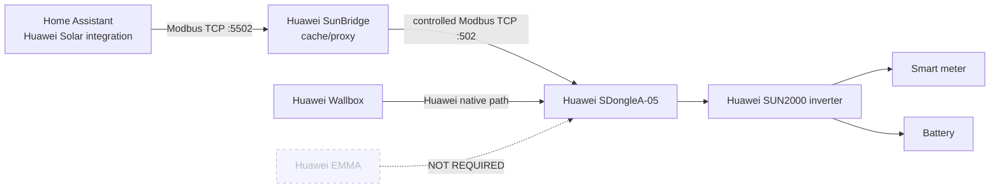
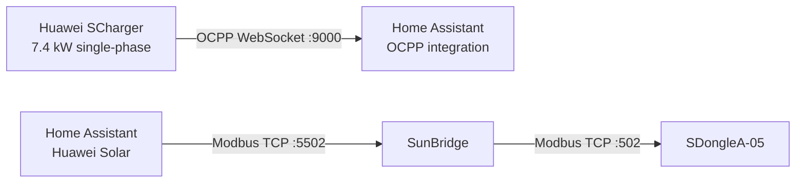

# Home Assistant + Huawei Solar

Huawei SunBridge Modbus is designed so that the **Huawei Solar Home Assistant integration can be used at the same time as the rest of the Huawei installation** without giving Home Assistant its own direct long-lived Modbus connection to the SDongle.

## Recommended connection layout



## What this means

You can run **Huawei Solar in Home Assistant concurrently** with the Huawei Wallbox / normal Huawei installation by configuring Huawei Solar to connect to **SunBridge instead of directly to the SDongle**.

The tested setup used:

```text
Huawei Solar host: <SunBridge LAN IP>
Huawei Solar port: 5502
Modbus Unit ID: 1
```

SunBridge then talks to the SDongle on:

```text
SDongle port: 502
Modbus Unit ID: 1
```

This keeps Home Assistant from competing for another direct SDongle Modbus session.

## Important

- The Huawei Wallbox remains on the normal Huawei path.
- Do **not** redirect the Wallbox to SunBridge for Huawei Solar access.
- Huawei Solar connects to SunBridge on port `5502`.
- SunBridge connects upstream to the SDongle on port `502`.
- Huawei EMMA is **not required** for this architecture.
- The proxy path is entirely LAN-based.

## Optional: Huawei SCharger in Home Assistant via OCPP

The tested installation also includes a **Huawei SCharger 7.4 kW single-phase Wallbox**.

The Wallbox can be added to Home Assistant separately from SunBridge by using OCPP. This does **not** replace the Huawei Solar / SunBridge path; it adds a second, independent Home Assistant connection specifically for Wallbox status and control.

Tested Home Assistant component:

- `lbbrhzn/ocpp` (HACS custom integration)
- Home Assistant acting as the local OCPP Central System
- WebSocket listener on TCP port `9000`

Example local configuration used during testing:

```text
Home Assistant IP: 192.168.10.41
OCPP port: 9000
Charge point path / ID: huawei
Transport: ws (non-TLS, trusted LAN only)
```

This results in a Wallbox endpoint equivalent to:

```text
ws://192.168.10.41:9000/huawei
```

On the Huawei Wallbox, the business-platform / OCPP connection was configured with:

```text
Connection type: IP
Server IP: 192.168.10.41
Port: 9000
Path: huawei
Username: huawei
Password: empty
Authentication mode: non-secure transmission with basic authentication
```

After saving, Home Assistant discovered the charger successfully as an OCPP charge point.

### Confirmed OCPP status in Home Assistant

With the charger idle and no vehicle connected, Home Assistant showed:

```text
Status: Available
Status Connector: Available
Error Code: NoError
Reconnects: 0
Charge Point ID: huawei
Serial: huawei1
Model: ACChargePoint
```

The integration also exposed controls such as:

- Availability
- Charge Control
- Maximum Current
- Reset
- Unlock

and sensors for current, voltage, power, energy, session data and diagnostics.

Many meter/session sensors were still `Unknown` while the charger was idle. They have **not yet been validated during an active charging session**, so this documentation deliberately does not claim working live power/energy telemetry yet.

### OCPP architecture



The OCPP path and SunBridge path are independent:

- **OCPP** is used for the SCharger connection to Home Assistant.
- **SunBridge** is used for Huawei Solar inverter / meter / battery access.

Do not expose the non-TLS OCPP listener to the public Internet. The tested configuration is intended for a trusted local LAN.

## Tested result

With the tested SDongleA-05 / SUN2000-L1 installation, Huawei Solar could expose inverter, grid meter and battery entities through SunBridge while the Huawei Wallbox and FusionSolar remained operational.

The Huawei SCharger 7.4 kW single-phase Wallbox was also successfully connected to Home Assistant through the separate local OCPP integration described above.

Tested Huawei Solar integration version: **Huawei Solar 2.1.5**.
