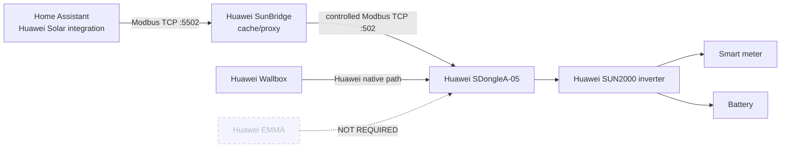

# Home Assistant + Huawei Solar

Huawei SunBridge Modbus is designed so that the **Huawei Solar Home Assistant integration can be used at the same time as the rest of the Huawei installation** without giving Home Assistant its own direct long-lived Modbus connection to the SDongle.

## Recommended connection layout



## What this means

You can run **Huawei Solar in Home Assistant concurrently** with the Huawei Wallbox / normal Huawei installation by configuring Huawei Solar to connect to **SunBridge instead of directly to the SDongle**.

The tested setup used:

```text
Huawei Solar host: <SunBridge LAN IP>
Huawei Solar port: 5502
Modbus Unit ID: 1
```

SunBridge then talks to the SDongle on:

```text
SDongle port: 502
Modbus Unit ID: 1
```

This keeps Home Assistant from competing for another direct SDongle Modbus session.

## Important

- The Huawei Wallbox remains on the normal Huawei path.
- Do **not** redirect the Wallbox to SunBridge.
- Huawei Solar connects to SunBridge on port `5502`.
- SunBridge connects upstream to the SDongle on port `502`.
- Huawei EMMA is **not required** for this architecture.
- The proxy path is entirely LAN-based.

## Tested result

With the tested SDongleA-05 / SUN2000-L1 installation, Huawei Solar could expose inverter, grid meter and battery entities through SunBridge while the Huawei Wallbox and FusionSolar remained operational.

Tested integration version: **Huawei Solar 2.1.5**.
